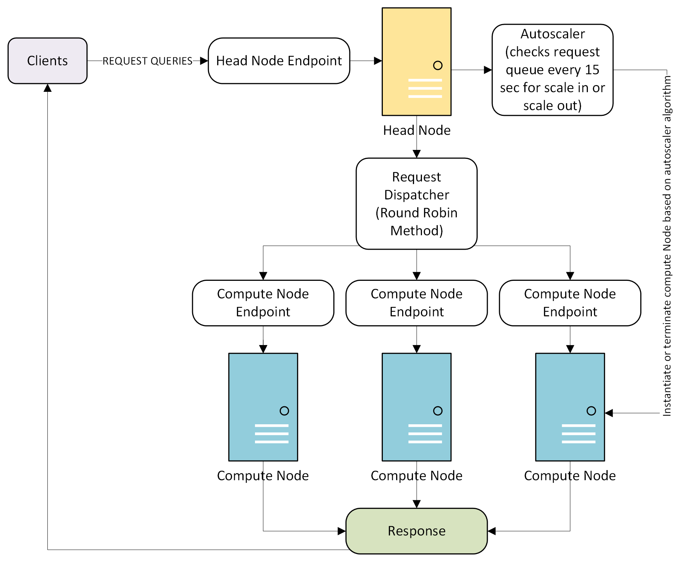

<!DOCTYPE html>
<html lang="en">
<head>
    <meta charset="UTF-8">
    <meta name="viewport" content="width=device-width, initial-scale=1.0">
    <title>README</title>
</head>
<body>

  <h1>GPU-Accelerated RAG from scratch and Model Serving System.</h1>

  
  
  
  
  
  

 

  

## 1. Project Overview

This project presents a high-performance system for information retrieval, designed for large-scale, high-dimensional vector search. It integrates GPU-level kernel optimizations with a robust, scalable model serving architecture. The system features two primary components:

1.  A **GPU-accelerated search pipeline** for both K-Nearest Neighbors (KNN) and Approximate Nearest Neighbors (ANN) that demonstrates significant speedups over traditional CPU-based methods.
2.  A **FastAPI-based serving system** for Retrieval-Augmented Generation (RAG) that handles real-time inference under high load using request queuing, batching, and dynamic autoscaling.

This repository provides the source code for implementing, benchmarking, and serving these advanced machine learning systems.

## 2. Motivation

### Why GPU Acceleration?
Modern machine learning applications in semantic search, recommendation, and classification depend on finding the most relevant items from vast datasets. This is typically framed as a nearest neighbor search over high-dimensional vectors. As datasets grow in size ($N$) and dimensionality ($D$), exact search becomes a computational bottleneck, with CPU throughput and I/O being primary constraints.

GPUs, with their massively parallel architecture, are designed for the high-throughput, repetitive operations inherent in distance calculations. By offloading this work to the GPU, we can transform response times from seconds to milliseconds, enabling low-latency retrieval that is crucial for production applications.

### Why Advanced Model Serving?
Deploying complex models like RAG systems introduces challenges distinct from standard web services. These models demand high throughput and low latency, and their computational intensity can easily overload a server during traffic spikes.

To address this, system-level optimizations are essential. Techniques like request queuing and batching smooth out traffic, maximize GPU utilization, and create a balance between throughput and latency. Furthermore, an autoscaling mechanism ensures that computational resources dynamically match demand, preventing both resource underutilization during quiet periods and performance degradation under high load.

## 3. System Architecture and Implementation

### How It Works: GPU-Accelerated Search

The core of the retrieval pipeline is built on efficient, parallelized distance computations.

* **Distance Functions**: The system implements and benchmarks four fundamental distance metrics: **L2 (Euclidean)**, **Dot Product**, **Cosine Similarity**, and **Manhattan (L1)**. These functions are implemented across multiple frameworks to compare performance, including:
    * **NumPy** as a CPU baseline.
    * **PyTorch** and **CuPy** for high-level GPU acceleration.
    * **Custom CUDA Kernels** and **Triton** for low-level control and maximum performance, utilizing optimizations like shared memory and parallel reduction.

* **Retrieval Pipelines**:
    * **Exact KNN**: A brute-force implementation that compares a query vector against all dataset vectors. The GPU version processes the dataset in chunks to manage memory and uses a hybrid top-k selection strategy (partial sort on GPU, final sort on CPU).
    * **Approximate ANN (LSH)**: To accelerate search, a Locality-Sensitive Hashing (LSH) based ANN system is implemented. It uses a two-stage process: first, it rapidly identifies a small set of candidate vectors using a Hamming distance prefilter, and second, it performs exact distance computations on only these candidates using the optimized GPU kernels.

### How It Works: Scalable RAG Serving System

The serving system is designed for resilience and performance under real-world conditions.

* **Request Queue and Batcher**: Incoming requests are managed by a thread-safe queue, which decouples the API endpoint from the processing logic. A background worker assembles requests into batches based on either size (`MAX_BATCH_SIZE = 8`) or a timeout (`MAX_WAITING_TIME = 0.1s`), ensuring a balance between latency and computational efficiency.

* **Autoscaler Architecture**: The system features a distributed architecture to handle variable workloads dynamically.
    * A **Head Node** acts as the entry point, receiving all client queries and placing them in a central queue.
    * An **Autoscaler** component monitors the queue length every 15 seconds. It scales the number of **Compute Nodes** up or down based on traffic.
    * A **Request Dispatcher** uses a round-robin algorithm to distribute tasks evenly across the available compute nodes, ensuring balanced workloads.

## 4. Project Structure

The repository is organized to separate concerns, with distinct modules for data handling, modeling, evaluation, and testing.

-   `src/data_ingestion/`: Contains modules for loading data.
-   `src/data_processing/`:
    -   `distances.py`: Implementation of the L2, Dot, Cosine, and Manhattan distance functions across different frameworks.
-   `src/evaluation/`:
    -   `benchmark.py`: Scripts for performance testing and benchmarking of the distance functions and retrieval pipelines.
-   `src/modeling/`:
    -   `knn.py`: Core logic for the KNN and ANN (LSH-based) retrieval algorithms.
    -   `rag.py`: Implementation of the RAG pipeline and the FastAPI serving system, including the request queue and batcher.
-   `src/tests/`:
    -   Unit tests for the distance functions, KNN/ANN algorithms, and RAG components to ensure correctness and stability.

</body>
</html>
